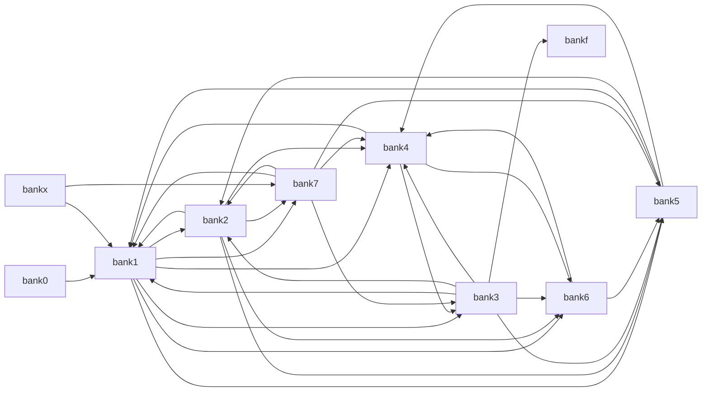

# Stevie bank-to-bank far-jump dependency graph

This graph shows the main ROM bank relationships as they are expressed in the cartridge stubs (`rom.stubs.bank*.asm`). The actual runtime call pattern is not one-way from a single file; instead, every bank can call into other banks using the `rom.farjump` trampoline.

## Key idea

- `rom.farjump` is the cross-bank trampoline used by code in all banks above 0.
- Each bank-specific stub file defines entry points that forward to functions living in another bank.
- The pattern is therefore a dependency graph between banks, not just a file layout.

## Main bank relationships

| Bank | Calls into |
| --- | --- |
| bank1 | bank2, bank3, bank4, bank5, bank6, bank7 |
| bank2 | bank1, bank4, bank5, bank6, bank7 |
| bank3 | bank1, bank2, bank4, bank5, bank6, bankf |
| bank4 | bank1, bank3, bank6 |
| bank5 | bank1, bank2, bank4 |
| bank6 | bank4, bank5 |
| bank7 | bank1, bank2, bank3, bank4, bank5 |
| bankx | bank1, bank7 |

## Mermaid graph

## Interpretation

This reveals the architectural split:

- Bank 1 is the central hub. It reaches into almost every other editor/data bank.
- Bank 2 is the file-manager bank, and it calls back into the editor and display banks.
- Bank 3 is the dialog/UI bank and reaches into the editor, file manager, and help/display subsystems.
- Bank 4 is the framebuffer and pane rendering bank, frequently called by display-oriented code.
- Bank 5 handles editor buffer and block operations, and is called from both the editor and the file-management stack.
- Bank 6 is a deeper display / VDP helper bank, mostly serving the editor and buffer layers.
- Bank 7 is a bridge bank for TI-Basic / SAMS / memory setup and calls back into the editor stack.

## Examples from the code

Representative stubs show the pattern directly:

- `rom.stubs.bank1.asm` calls into `bank2.rom`, `bank3.rom`, `bank4.rom`, `bank5.rom`, `bank6.rom`, `bank7.rom`.
- `rom.stubs.bank2.asm` calls back into `bank1.rom`, `bank4.rom`, `bank5.rom`, `bank6.rom`, `bank7.rom`.
- `rom.stubs.bank5.asm` forwards into `bank1.rom`, `bank2.rom`, and `bank4.rom`.
- `rom.stubs.bank7.asm` bridges to `bank1.rom`, `bank2.rom`, `bank3.rom`, `bank4.rom`, and `bank5.rom`.

The exact far-jump edges are defined by the stub files, so this graph is meant to summarize the runtime architecture rather than to list every single vector in the project.
