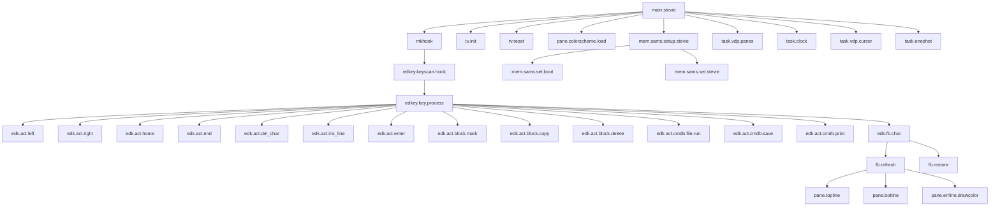
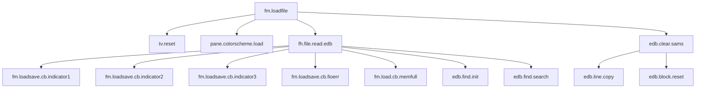
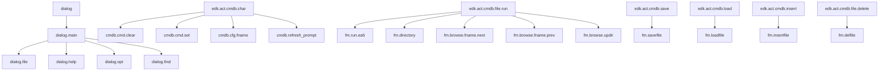
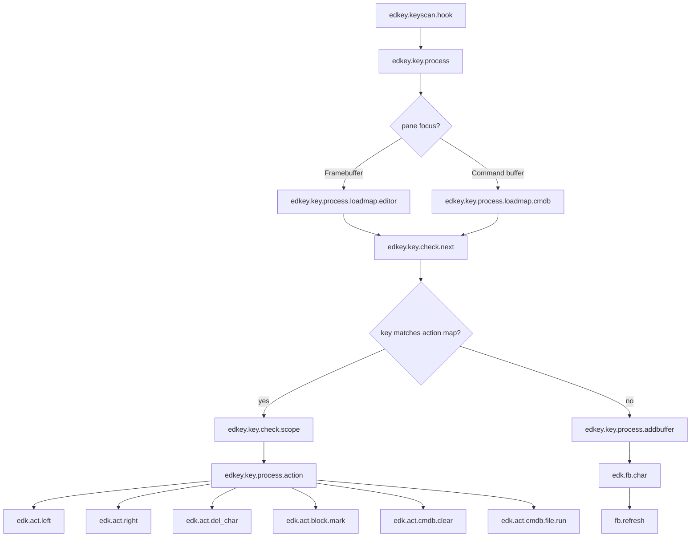
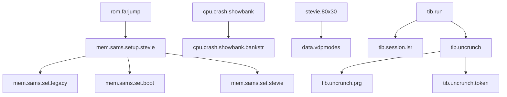

# Stevie function dependency graph

This is a high-level dependency graph at the assembly-subroutine level. It focuses on the main runtime flow of Stevie rather than every tiny helper. The goal is to show how the editor boots, dispatches keyboard actions, loads files, and triggers lower-level hardware and dialog support.

Note: because this codebase uses bank stubs and far jumps, the same logical routine may be reached from several banks. This graph therefore emphasizes the runtime relationships and ownership, not a strict bank-to-function mapping.

## Main runtime flow

## File load and editor reset path

## Dialog and command-buffer flow

## Keyboard dispatch detail

## Memory / low-level bridge layer

## Dependency interpretation

The graph shows three major layers:

1. Startup layer: `main.stevie` sets up VDP, SAMS, screen state, task scheduler, and the keyboard hook.
2. Editor action layer: `edkey.key.process` dispatches to `edk.act.*` and `edk.fb.*` routines for movement, editing, blocks, and command actions.
3. Service layer: `fm.*`, `dialog.*`, `pane.*`, and `tib.*` routines build the higher-level editor features on top of low-level SAMS/VDP and bank-switch support.

This is intentionally a dependency overview rather than a complete call tree. The assembler code uses many inline `bl @label` calls and several callback-based flows, so the real graph is more dense than the simplified diagram above.
